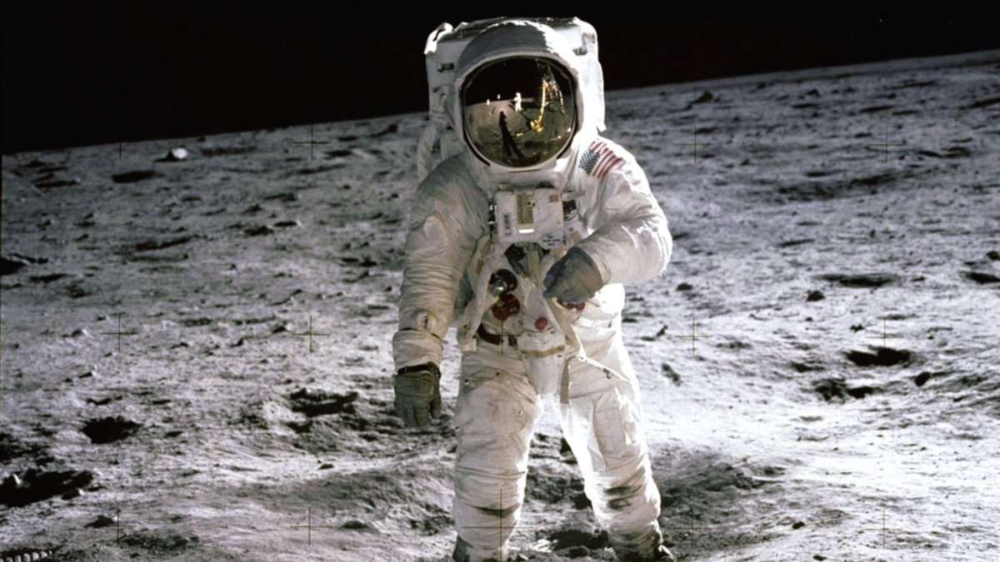
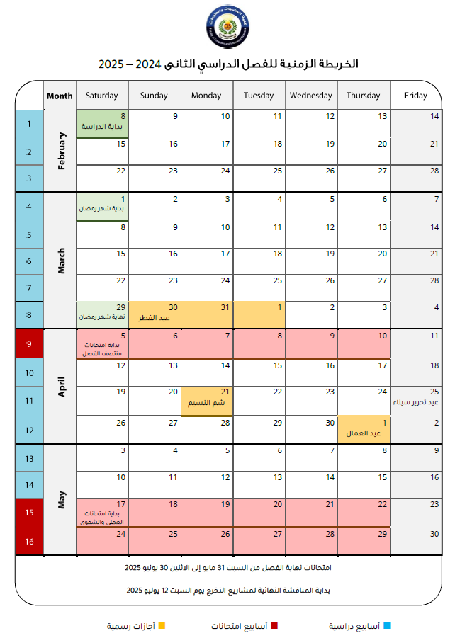

# 6th Term Materials

---

## Navigation
- **Google Drive** : [Drive](https://drive.google.com/drive/u/1/folders/1JpLiTePMj2eTF9ld3BIjwj0x0hfCT1ip)
- [Deep learning](https://github.com/Abdul-Rahman-Shokry/Faculty_materials/blob/main/6th_term/Deep_learning.md)
- [Computer Vision](https://github.com/Abdul-Rahman-Shokry/Faculty_materials/blob/main/6th_term/Computer_vision.md)
- [Big Data](https://github.com/Abdul-Rahman-Shokry/Faculty_materials/blob/main/6th_term/Big_data.md)
- [NLP](https://github.com/Abdul-Rahman-Shokry/Faculty_materials/blob/main/6th_term/NLP.md)
- [Research](https://github.com/Abdul-Rahman-Shokry/Faculty_materials/blob/main/6th_term/Research.md)
- [Expert Systems](https://github.com/Abdul-Rahman-Shokry/Faculty_materials/blob/main/6th_term/Expert_systems.md)
---

## Mid term
- Sat, 5 April: **Expert 10:00**
- Sun, 6 April: **Big Data 10:00**
- Mon, 7 April: **CV 9:00**
- Tue, 8 April: **DL 9:00**
- Wed, 9 April: **NLP 11:00**
- Thu, 10 April: **Research 11:00**

---

## Term plan
